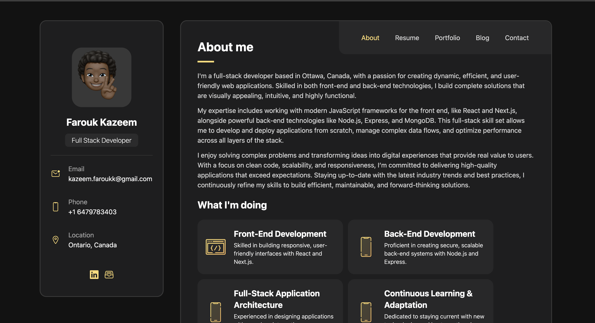

# Portfolio Website

A personal portfolio website showcasing my projects, skills, resume, and blog. The website serves as a platform to display my work, share insights on my blog, and provide an overview of my background and experience.

## 🌟 Project Overview

This portfolio website is designed to give potential employers and collaborators a comprehensive view of my technical skills and professional experience. Built with React and Tailwind CSS, it features a responsive and clean design that works seamlessly across devices. Each section is dedicated to different aspects of my work, including an About section, a Resume, a Portfolio of my projects, and a Blog for sharing knowledge.

## 🚀 Features

- **About**: A brief introduction and background information.
- **Resume**: An overview of my professional experience, education, and skills.
- **Portfolio**: Showcases my projects with descriptions, technologies used, and links to live demos or repositories.
- **Blog**: Posts about various technical topics, personal insights, or tutorials.
- **Contact**: A contact form for visitors to reach out to me directly.

## 🛠️ Technologies Used

- **Frontend**: React, React Router
- **Styling**: Tailwind CSS
- **Routing**: React Router for navigation
- **Deployment**: Vercel

## 📸 Screenshots



## 📂 Project Structure

```plaintext
src/
├── components/        # Reusable components (Navbar, Footer, etc.)
├── pages/             # Different sections of the portfolio (About, Resume, etc.)
├── App.js             # Main application component with routing
├── index.js           # Main entry file
└── App.css            # Custom styles
```

## 👤 Author

**Farouk Kazeem**  
Email: [kazeem.faroukk@gmail.com](mailto:kazeem.faroukk@gmail.com)  
LinkedIn: [Farouk](https://www.linkedin.com/in/farouk-kazeem-750064178/)

## 🤝 Contributing

Contributions, issues, and feature requests are welcome! Feel free to check the [issues page](#) if you want to contribute.
